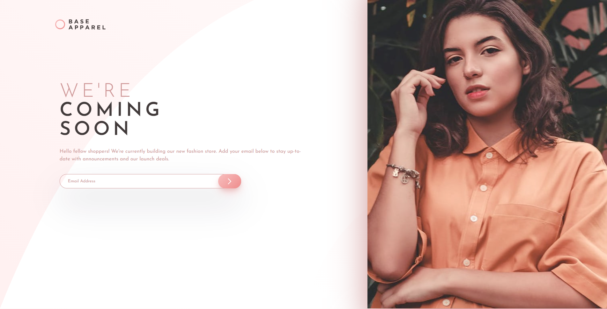

# Frontend Mentor - Base Apparel coming soon page solution

This is a solution to the [Base Apparel coming soon page challenge on Frontend Mentor](https://www.frontendmentor.io/challenges/base-apparel-coming-soon-page-5d46b47f8db8a7063f9331a0). Frontend Mentor challenges help you improve your coding skills by building realistic projects. 

## Table of contents

- [Overview](#overview)
  - [The challenge](#the-challenge)
  - [Screenshot](#screenshot)
  - [Links](#links)
- [My process](#my-process)
  - [Built with](#built-with)
- [Author](#author)

## Overview

### The challenge

Users should be able to:

- View the optimal layout for the site depending on their device's screen size
- See hover states for all interactive elements on the page
- Interact with the form submission button

### Screenshot

### Links

- Solution URL: [https://www.frontendmentor.io/solutions/base-apparel-coming-soon-page-0cSfUjsRn]
- Live Site URL: [https://jiale456.github.io/base-apparel-coming-soon-master/]

## My process

### Built with

- HTML5
- CSS3
- SCSS
- CSS Grid
- Mobile-first workflow
- RWD Concept

## Author

- Frontend Mentor - [@jiale456](https://www.frontendmentor.io/profile/jiale456)
- GitHub - [@jiale456](https://github.com/jiale456)

